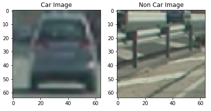
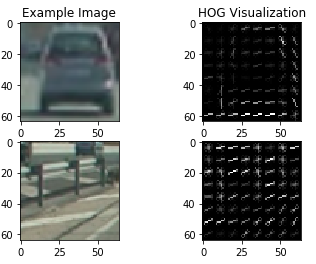
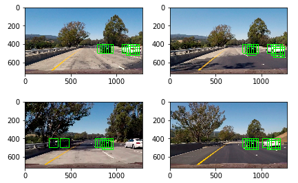
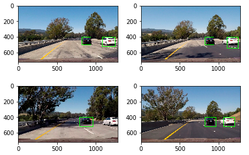
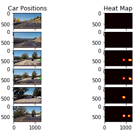

##Writeup Template
###You can use this file as a template for your writeup if you want to submit it as a markdown file, but feel free to use some other method and submit a pdf if you prefer.

---

**Vehicle Detection Project**

The goals / steps of this project are the following:

* Perform a Histogram of Oriented Gradients (HOG) feature extraction on a labeled training set of images and train a classifier Linear SVM classifier
* Optionally, you can also apply a color transform and append binned color features, as well as histograms of color, to your HOG feature vector. 
* Note: for those first two steps don't forget to normalize your features and randomize a selection for training and testing.
* Implement a sliding-window technique and use your trained classifier to search for vehicles in images.
* Run your pipeline on a video stream (start with the test_video.mp4 and later implement on full project_video.mp4) and create a heat map of recurring detections frame by frame to reject outliers and follow detected vehicles.
* Estimate a bounding box for vehicles detected.

[//]: # (Image References)
[image1]: ./examples/car_not_car.png
[image2]: ./examples/HOG_example.jpg
[image3]: ./examples/sliding_windows.jpg
[image4]: ./examples/sliding_window.jpg
[image5]: ./examples/bboxes_and_heat.png
[image6]: ./examples/labels_map.png
[image7]: ./examples/output_bboxes.png
[video1]: ./project_video.mp4

## [Rubric](https://review.udacity.com/#!/rubrics/513/view) Points
###Here I will consider the rubric points individually and describe how I addressed each point in my implementation.  

---
###Writeup / README

####1. Provide a Writeup / README that includes all the rubric points and how you addressed each one.  You can submit your writeup as markdown or pdf.  [Here](https://github.com/udacity/CarND-Vehicle-Detection/blob/master/writeup_template.md) is a template writeup for this project you can use as a guide and a starting point.  

You're reading it!

###Histogram of Oriented Gradients (HOG)

####1. Explain how (and identify where in your code) you extracted HOG features from the training images.

The code for this step is contained in the fourth code cell of the IPython notebook.  
I started by reading in all the `vehicle` and `non-vehicle` images.  Here is an example of one of each of the `vehicle` and `non-vehicle` classes:

[vehicle/non_vehicle](https://github.com/aman-ahluwalia/CarND-Vehicle-Detection/blob/master/output_images/vehicle_non_vehicle.jpg)

I then explored different color spaces and different `skimage.hog()` parameters (`orientations`, `pixels_per_cell`, and `cells_per_block`).  I grabbed random images from each of the two classes and displayed them to get a feel for what the `skimage.hog()` output looks like.

Here is an example using the `YCrCb` color space and HOG parameters of `orientations=8`, `pixels_per_cell=(8, 8)` and `cells_per_block=(2, 2)`:

[hog-feature](https://github.com/aman-ahluwalia/CarND-Vehicle-Detection/blob/master/output_images/hog-feature.jpg)

####2. Explain how you settled on your final choice of HOG parameters.

I tried various combinations of parameters and finally the decided parameters on the basis of accuracy and the clearity of the answer in the given domain, with following:
	color_space = 'YCrCb'
	orient = 9
	pix_per_cell = 8
	cell_per_block = 2
	hog_channel = "ALL"
	spatial_size = (8, 8)
	hist_bins = 16
	spatial_feat = True
	hist_feat = True
	hog_feat = True
	ystart = 400
	ystop = None
	scale = 1.5

####3. Describe how (and identify where in your code) you trained a classifier using your selected HOG features (and color features if you used them).

I trained a linear SVM using shuffled training data of feature vector length 5532. It took 41.59 seconds on my local machine for the classifier to train, and the accuracy on the test set was found to be 0.9932 . The code for the following is presented in the 12th code cell of the iPython notebook.

###Sliding Window Search

####1. Describe how (and identify where in your code) you implemented a sliding window search.  How did you decide what scales to search and how much to overlap windows?

The code is presented in the 13th cell of the iPython notebook. I decided to search window positions at 1.5 scale in the lower half of the image i.e. from y=400 and came up with this :

[sliding window](https://github.com/aman-ahluwalia/CarND-Vehicle-Detection/blob/master/output_images/hog-feature.jpg)

####2. Show some examples of test images to demonstrate how your pipeline is working.  What did you do to optimize the performance of your classifier?

Ultimately I searched on 1.5 scales using YCrCb 3-channel HOG features plus spatially binned color and histograms of color in the feature vector, which provided a nice result.  Here are some example images:

[final_pipeline](https://github.com/aman-ahluwalia/CarND-Vehicle-Detection/blob/master/output_images/hog-feature.jpg)

### Video Implementation

####1. Provide a link to your final video output.  Your pipeline should perform reasonably well on the entire project video (somewhat wobbly or unstable bounding boxes are ok as long as you are identifying the vehicles most of the time with minimal false positives.)
Here's a [link to my video result](https://github.com/aman-ahluwalia/CarND-Vehicle-Detection/blob/master/project_video_solution.mp4)

####2. Describe how (and identify where in your code) you implemented some kind of filter for false positives and some method for combining overlapping bounding boxes.

I recorded the positions of positive detections in each frame of the video.  From the positive detections I created a heatmap and then thresholded that map to identify vehicle positions.  I then used `scipy.ndimage.measurements.label()` to identify individual blobs in the heatmap.  I then assumed each blob corresponded to a vehicle.  I constructed bounding boxes to cover the area of each blob detected.  

Here's an example result showing the heatmap from a test image, the result of `scipy.ndimage.measurements.label()` and the bounding boxes then overlaid on the test image:

### Here are six test images and their corresponding heatmaps:

[six-frame-heatmap](https://github.com/aman-ahluwalia/CarND-Vehicle-Detection/blob/master/output_images/six_frame_hist.jpg)

###Discussion

####1. Briefly discuss any problems / issues you faced in your implementation of this project.  Where will your pipeline likely fail?  What could you do to make it more robust?

The hog sampling approach i am using allows to extract the hog features just once and then can be sub-sampled to get all of its overlaying windows. Each window is defined by a scaling factor where a scale of 1 would result in a window that's 8 x 8 cells then the overlap of each window is in terms of the cell distance.
The problem i faced was to tune the parameters plus some image format problem. One more problem which i think could affect the results is the size of the image. As we are using a factor of 64, so it would be fully dividable, hence the cars in the corner which are just overtaking may cause problem. This may be further area to visit as we have to play with hog feature with variable window size. 

